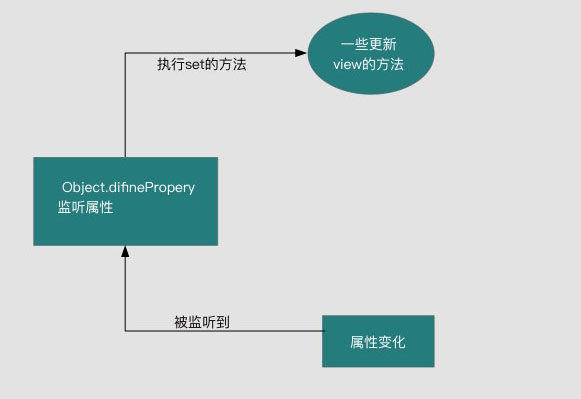

# 一、MVVM原理简介

所谓MVVM其实就是Model、View 和ViewModel：

- Model：模型层（数据层），主要用于保存一些数据
- View： 视图层，主要用于将后端数据借助各种元素呈现给用户，同时也可提供用户操作的入口
- ViewModel：视图模型层：该层也是MVVM中的核心层，主要用于作为Model个View两个层的数据连接层，负责两个层之间的数据传递。该层主要包含两大功能点：
  + DOM监听（DOM Listener） 用于监听DOM元素的一些事件，如果DOM元素发生变化在需要的时候会改变对应的data
  + 数据绑定（Data bindings）用于将Model的改变反应在View上及时呈现给用户

# 二、MVVM流程分析

实现MVVM主要包含两个方面，数据变化更新视图，视图变化更新数据：

为了实现这一框架，vue.js 采用数据劫持结合发布-订阅模式的方式，通过Object.defineProperty()来劫持各个属性的setter，getter，在数据变动时发布消息给订阅者，触发相应的监听回调。

有鉴于此，我们也可以沿着 Vue 的这一思路，将整个过程具体分为以下三个步骤：数据劫持、模板编译和双向绑定。

## 1. 数据劫持

Object.defineProperty()是JavaScript标准提供的一个对象内置方法，它可以直接在一个对象上定义一个新属性，或者修改一个对象的现有属性，接受三个参数：第一个参数是要定义属性的对象，第二个参数是要定义或修改的属性的名称，第三个参数是一个配置项对象（包括：value、enumerable、configurable、get和set等几个属性）。

我们就可以借助这个方法来实现数据的劫持，这时候接收的三个参数分别对应：第一个参数是被劫持的对象，第二个参数是被劫持的对象中的属性（key），第三个参数仍是一个配置项对象。主要用到的是get和set两个配置项，通过该方法被劫持的对象属性，只要在外界获取或者修改属性值就会触发get或set方法，这样我们就可以在get或set中对属性做一些额外操作，从而实现数据劫持。

## 2. 模板编译

为了实现类似 Vue 中通过一些指令或者小胡子语法来实现数据绑定的操作，我们在数据劫持后需要进行模板编译，否则浏览器并不认识这些指令或者小胡子语法，也就不会按照我们的想法进行显示。因此在页面加载后我们需要将这些语法转换成真正的数据呈现给用户，这也就是模板编译的主要功能。

## 3. 双向绑定

有了模板编译，我们可以将指令和数据进行单向的绑定了，这时候，当数据发生变化时，页面也会随之变化，但页面发生变化时，数据还不会发生变化，要想实现后者，就需要进行第三步，双向绑定。

在前面数据劫持的时候我们提到，数据劫持的目的就是为了在获取数据或给数据赋值之前对数据做一些额外的操作，那么这些额外的操作其实就是利用发布-订阅模式对数据属性进行监控，比如说data中的name属性，首先需要知道这个name属性都在哪里用到了，以便后面如果name值发生改变时及时通知用到name的地方同步更新，这个在 Vue 中叫做**依赖收集**。

# 三、MVVM具体实现

综上所述，要实现数据的双向绑定，首先要对数据进行劫持监听，所以我们需要设置一个监听器Observer，用来监听所有属性。如果属性发生变化了，就需要告诉订阅者Watcher看是否需要更新。因为订阅者是有很多个，所以我们需要有一个消息订阅器Dep来专门收集这些订阅者，然后在监听器Observer和订阅者Watcher之间进行统一管理。接着，我们还需要有一个指令解析器Compiler，对每个节点元素进行扫描和解析，将相关指令对应初始化成一个订阅者Watcher，并替换模板数据或者绑定相应的函数，此时当订阅者Watcher接收到相应属性的变化，就会执行对应的更新函数，从而更新视图。因此接下去我们需要实现以下几点：

1. 实现一个监听器Observer，用来劫持并监听所有属性，如果有变动的，就通知订阅者。

2. 实现一个订阅者Watcher，可以收到属性的变化通知并执行相应的函数，从而更新视图。

3. 实现一个解析器Compile，可以扫描和解析每个节点的相关指令，并根据初始化模板数据以及初始化相应的订阅器。
   
4. MVVM入口函数，整合以上三者

流程图如下：

具体分为以下几个模块：

## 1.observer

- Observer类实现对所有数据的劫持，该类中写了两个方法：walk() 和 defineReactive()
- walk()方法用来遍历对象，仅当接收参数为对象类型时，才会进行后续操作，调用defineReactive()函数。
- defineReactive()方法用来调用 **Object.defineProperty()** 方法，同时为其提供一个闭包环境。
- 需要注意的是，对于复杂的多层对象数据类型而言，需要继续向下一层遍历，因此在defineReactive()中还要再调用walk()方法。

## 2.compiler

Compiler主要做的事情是解析模板指令，将模板中的变量替换成数据，然后初始化渲染页面视图，并将每个指令对应的节点绑定更新函数，添加监听数据的订阅者，一旦数据有变动，收到通知，更新视图。

因为遍历解析的过程有多次操作dom节点，为提高性能和效率，会先将实例根节点的el转换成文档碎片fragment进行解析编译操作，解析完成，再将fragment添加回原来的真实dom节点中，这样，在所有节点遍历完成后只需要一次消耗，从而可以大大降低回流重汇带来的性能损耗。

- 遍历#app下所有的节点，然后根据节点的类型做相应的操作，把原始dom转换为文档碎片
- 如果是一些注释节点或无用的换行等节点，则直接略去，不添加到文档碎片中去
- 如果是元素节点，获取该节点中所有的属性（attributes）并遍历看是否有指令
  + 如果有 **s-model** 指令，则根据该指令绑定的属性名（data中的属性名）获取到对应到值，并赋值给节点的value属性
  + 如果有 **s-text** 指令，则通知Watcher更新视图
  + 如果是 **@** 开头的事件，则执行函数编译，实现绑定事件功能。
- 如果是文本节点，则看该文本内容中是否包含小胡子语法
  + 如果有小胡子语法，同样需要解析出小胡子中绑定的属性名（data中的属性名）并获取到对应到值替换该文本内容
- 遍历完每个节点后再将该节点作为子节点添加到html到文档碎片中
- 最后再将整个文档碎片添加到dom中

## 3.watcher

Watcher订阅者作为Observer和Compile之间通信的桥梁，主要做的事情是: 
- 在自身实例化时往属性订阅器(dep)里面添加自己 
- 自身必须有一个update()方法 
- 待属性变动dep.notice()通知时，能调用自身的update()方法，并触发Compile中绑定的回调，则功成身退。

## 4.dep

- Dep类用于对属性进行依赖收集和通知用到属性的地方进行同步更新
- 在模板编译的时候，通过watcher来监听属性
- 在数据劫持的get函数中进行依赖收集
- 在数据劫持的set函数中通知各个watcher进行数据更新

## 5.MVVM

MVVM作为数据绑定的入口，整合Observer、Compiler和Watcher三者，通过Observer来监听自己的model数据变化，通过Compiler来解析编译模板指令，最终利用Watcher搭起Observer和Compiler之间的通信桥梁，达到数据变化 -> 视图更新；视图交互变化(input) -> 数据model变更的双向绑定效果。